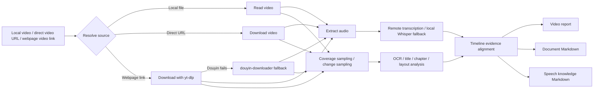

<div align="center">

# 🎬 Video Understanding Skill

Understand local videos, direct video URLs, and webpage video links, then turn them into reusable knowledge Markdown.

It combines transcript, OCR, visual-change sampling, document extraction, and timeline-aware reporting.

[中文](README.md) | [Skill Guide](SKILL.md)


</div>

---

## Why This Exists

Many video summaries stop at “sample a few frames and guess.” That usually misses later sections, loses alignment between speech and visuals, and fails to turn on-screen documents or course pages into usable knowledge.

`video-understanding` does not pretend to add magical native video reasoning. Instead, it builds a stable workflow:

- extract audio and transcribe speech
- sample across the whole video, not just the opening frames
- support “sample every meaningful page change” for screen recordings
- run OCR on screen regions and document regions
- extract visible documents into Markdown
- align evidence into a timeline, report, and knowledge notes

---

## Beginner-Friendly Installation

If you do not want to set this up manually, just give the repository link to your AI assistant or Codex and ask it to install the skill:

```text
https://github.com/Dublin1231/Video-Understanding-Skill
```

Example prompt:

```text
Please install this Codex skill for me and check whether Python, FFmpeg, Whisper, and OCR dependencies are available:
https://github.com/Dublin1231/Video-Understanding-Skill
```

---

## Feature Overview

| Feature | Description |
| --- | --- |
| 🔗 Video URL analysis | Supports local files, direct media URLs, and webpage video links supported by `yt-dlp` |
| 🎙️ Speech transcription | Extract creator, lecturer, or presenter audio from a video |
| 🧠 Speech to knowledge Markdown | Organize transcripts into ideas, methods, tools, cases, and timestamped excerpts |
| 🖥️ Whole-video coverage sampling | Sample across the full duration, not just the beginning |
| 🔄 Change-aware sampling | Capture meaningful page/layout changes for screen recordings |
| 🧭 Chapter-nav understanding | Use title and bottom navigation cues to better detect real section changes |
| 🔎 Chinese + English OCR | Read screen text, course pages, and visible documents |
| 📄 Document extraction | Convert visible articles, notes, course pages, slides, and documents into Markdown |
| 🪪 Rich Obsidian frontmatter | Generate stronger frontmatter ready for Obsidian |
| 🖼️ Smarter keyframe selection | Prefer high-signal keyframes instead of copying every sampled frame |
| 🧑‍🤝‍🧑 Speaker summaries | Add conservative speaker overviews only when transcript labels really exist |
| 🧰 Local Whisper fallback | Fall back to local `faster-whisper` when remote transcription is unavailable |

---

## Workflow



---

## Requirements

| Requirement | Required | Purpose |
| --- | --- | --- |
| Python 3.11+ | Required | Run scripts |
| FFmpeg | Required | Extract audio and frames |
| `openai` | Optional | Remote transcription and multimodal synthesis |
| `faster-whisper` | Optional | Local offline transcription |
| `yt-dlp` | Optional | Download webpage video links |
| `pillow` | Optional | Image processing |
| `pytesseract` | Optional | OCR |
| Tesseract Chinese/English data | Optional | Better OCR quality |

Install Python packages:

```powershell
python -m pip install openai faster-whisper yt-dlp pillow pytesseract
```

---

## Model And Runtime Setup

Recommended setups:

| Goal | Recommended Flags | Notes |
| --- | --- | --- |
| Speech-only notes | `--speech-only --local-whisper-model small` | Stable beginner path, mostly local |
| Full video understanding | `--model <your multimodal model>` | Combines visuals, OCR, speech, and timeline evidence |
| Remote transcription fallback | `--local-whisper-model small` | Automatically falls back to local Whisper |
| Faster local transcription | `--local-whisper-model base` | Faster, usually less accurate |
| More accurate local transcription | `--local-whisper-model medium` | Heavier and slower |

Common flags:

```powershell
--model "gpt-5.4"
--transcribe-model "gpt-4o-transcribe-diarize"
--local-whisper-model "small"
```

---

## API Key And Base URL

If you only use `--speech-only` with local Whisper, you do not need remote API access.  
For full video understanding, remote transcription, or multimodal synthesis, configure local environment variables.

Temporary PowerShell setup:

```powershell
$env:OPENAI_API_KEY = "<your_key>"
$env:OPENAI_BASE_URL = "<your_base_url>"
```

Persistent Windows user setup:

```powershell
[Environment]::SetEnvironmentVariable("OPENAI_API_KEY", "<your_key>", "User")
[Environment]::SetEnvironmentVariable("OPENAI_BASE_URL", "<your_base_url>", "User")
```

---

## Quick Start

Probe your environment first:

```powershell
python scripts/capability_probe.py
```

Analyze a local video:

```powershell
python scripts/analyze_video_with_openai.py "C:\path\to\video.mp4" `
  --question "What is said in this video, and what happens on screen?" `
  --ocr `
  --obsidian-frontmatter `
  --copy-keyframes-dir "outputs\video-assets" `
  --markdown-keyframes report `
  --report-md "outputs\video-report.md" `
  --report-json "outputs\video-report.json"
```

Analyze a video URL:

```powershell
python scripts/analyze_video_with_openai.py "https://example.com/video.mp4" `
  --question "What is said in this video, and what happens on screen?" `
  --ocr `
  --report-md "outputs\video-report.md"
```

---

## Choose By Goal

| Goal | Recommended Use |
| --- | --- |
| Understand what is said and shown | `--ocr --report-md` |
| Turn speaker audio into knowledge notes | `--speech-only --speech-md-mode knowledge --extract-speech-md <path>` |
| Get a timestamped raw transcript | `--speech-only --speech-md-mode literal --extract-speech-md <path>` |
| Extract a visible document or article | `--doc-only --doc-md-mode literal --extract-doc-md <path>` |
| Analyze every meaningful page change | `--sampling-mode all-changes --scene-detection --screen-layout-filter` |
| Let titles and bottom nav influence section changes | `--title-ocr-filter --chapter-nav-filter --same-chapter-dedupe-filter` |

---

## Obsidian Output

For Obsidian-ready notes, add:

```powershell
--obsidian-frontmatter `
--copy-keyframes-dir "outputs\video-assets" `
--markdown-keyframes report
```

Frontmatter now includes:

- `source` / `source_url`
- `video_path`
- `duration_seconds`
- `model`
- `transcript_source`
- `transcript_coverage`
- `speaker_count`
- `sampling_mode`
- `sampling_strategy`
- `aliases`
- `tags`

Keyframe output is also smarter now. Instead of blindly copying every sampled frame, it prefers:

- first / middle / last anchors
- OCR-rich frames
- stronger layout-change evidence
- frames aligned with transcript context

---

## Speech To Knowledge Markdown

```powershell
python scripts/analyze_video_with_openai.py "C:\path\to\video.mp4" `
  --speech-only `
  --speech-md-mode knowledge `
  --extract-speech-md "outputs\speech-knowledge.md"
```

Notes:

- `knowledge` generates structured knowledge notes
- `literal` preserves the transcript by timestamp
- if the transcription provider returns real speaker labels, the Markdown adds a conservative speaker overview section
- if local Whisper fallback is used and no speaker labels exist, the skill does not fake diarization

---

## Document Extraction To Markdown

```powershell
python scripts/analyze_video_with_openai.py "C:\path\to\video.mp4" `
  --sampling-mode all-changes `
  --scene-detection `
  --screen-layout-filter `
  --title-ocr-filter `
  --chapter-nav-filter `
  --doc-only `
  --doc-md-mode literal `
  --extract-doc-md "outputs\document.md" `
  --report-json "outputs\document-check.json"
```

Notes:

- `literal` is better when you want screen-faithful extracted text
- `polished` reorganizes content into more knowledge-base-like sections
- document extraction is now more conservative and filters weak UI-heavy OCR frames more aggressively
- repeated near-duplicate document pages are deduplicated before building Markdown

---

## Cookies And Webpage Videos

For Douyin, course platforms, or sites that require login state, the most reliable path is a Netscape-format `cookies.txt`.

If you use **Get cookies.txt LOCALLY**:

1. Open the target video page and confirm it can play.
2. Click the extension icon.
3. Confirm the current site is the one you want.
4. Set `Export Format` to `Netscape`.
5. Click the blue `Export` button.
6. Do not use `Export All Cookies`.
7. Pass the exported `cookies.txt` file to the script.

Example:

```powershell
python scripts/analyze_video_with_openai.py "https://www.douyin.com/video/7623595912924777780" `
  --cookies "C:\Users\YourName\Downloads\www.douyin.com_cookies.txt" `
  --douyin-downloader-fallback `
  --ocr `
  --report-md "outputs\web-video-report.md"
```

---

## Current Status

Recently completed:

- richer Obsidian frontmatter templates
- smarter keyframe selection
- more conservative document extraction and OCR cleanup
- optional speaker summaries when real speaker labels are available

Still worth improving:

- even more stable chapter-aware long-video sampling
- stronger OCR cleanup for low-resolution noisy captures
- richer multi-speaker role summaries for interviews or panel content

---

## License

MIT License.
