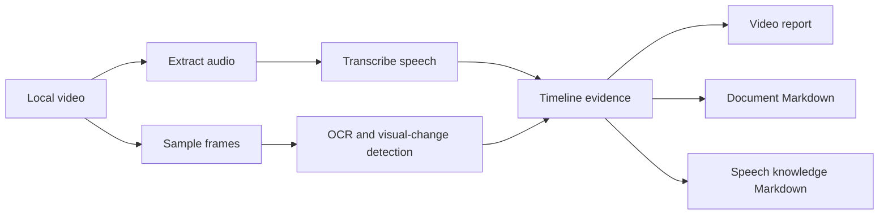

<div align="center">

# 🎬 Video Understanding Skill

Turn local videos into searchable, reusable, knowledge-base-ready Markdown.

It listens to speech, inspects visual changes, reads on-screen text, and preserves timestamped evidence along the way.

[中文](README.md) | [Full Skill Guide](SKILL.md)


</div>

---

## Why This Exists

Basic video summaries often stop at "sample a few frames and guess": speech and visuals drift apart, late-video content gets skipped, and documents or captions on screen are easy to miss.

`video-understanding` turns video analysis into a more reliable workflow: transcribe audio, sample visual changes, run OCR, extract document-like content, align everything on a timeline, and produce Markdown that can go straight into a knowledge base.

It is useful for:

- Creator videos, courses, podcasts, interviews, and tutorials
- Screen recordings, product demos, and software walkthroughs
- Extracting visible documents, articles, notes, and course pages into Markdown
- Turning videos into Obsidian, Notion, or personal knowledge-base material

---

## ⚠️ Important Note

This repository is safe to publish when it contains only source code and documentation.

Do not commit local credentials, private configuration, downloaded models, binary tools, videos, transcripts, screenshots, or generated reports. The included `.gitignore` excludes `models/`, `vendor/`, `tools/`, `outputs/`, media files, and common local caches.

---

## 🌱 Beginner-Friendly Installation

If you are not comfortable with command-line setup, just give this repository link to your AI assistant or Codex and ask it to install the skill for you:

```text
https://github.com/Dublin1231/Video-Understanding-Skill
```

Example prompt:

```text
Please install this Codex skill for me and check whether the local dependencies are available:
https://github.com/Dublin1231/Video-Understanding-Skill
```

The assistant can place the skill in the right directory and check Python, FFmpeg, local transcription, and OCR dependencies for your machine.

---

## 📸 Preview

### 🎙️ Speech Knowledge Markdown

```markdown
# Speaker Notes As Knowledge Markdown

## Core Ideas
- Obsidian is the long-term memory layer for tasks, cards, time plans, and personal experience.
- Claude Code is better for deep long-context work because it can organize existing knowledge-base content.
- OpenClaw is better as a lightweight mobile entry point for ideas, links, logs, and tasks.

## Original Speech Excerpts

### 01:03 - 02:15 Knowledge Base As Long-Term Memory

**Summary:** Use Obsidian to hold tasks, cards, and time notes so AI can read personal experience, goals, and working rules.

**Excerpt:** ...
```

### 📄 Document Markdown

```markdown
# Document Content

## Frame @ 62.23s

Text recognized from the visible document region is preserved here.
```

---

## ✨ Features

| Feature | Description |
| --- | --- |
| 🎙️ Speech transcription | Extract speaker, creator, or lecture audio from a video |
| 🧠 Speech to knowledge Markdown | Turn transcripts into core ideas, workflows, cases, and timestamped excerpts |
| 🎞️ Change-aware sampling | Sample frames based on page, layout, title, and chapter-navigation changes |
| 🔎 Chinese + English OCR | Read text from screen recordings, course pages, and document views |
| 📄 Document extraction | Convert visible articles, notes, slides, or documents into Markdown |
| 🧭 Timeline alignment | Align frames, transcript segments, OCR evidence, and timestamps |
| 🛟 Local fallback | Keep producing transcripts with local Whisper when remote transcription is unavailable |

---

## 🧩 Workflow



---

## 📦 Installation And Requirements

| Requirement | Required | Purpose |
| --- | --- | --- |
| Python 3.11+ | Required | Run scripts |
| FFmpeg | Required | Extract audio and frames |
| `openai` | Optional | Remote transcription and multimodal synthesis |
| `faster-whisper` | Optional | Local offline transcription |
| `pillow` | Optional | Image processing |
| `pytesseract` | Optional | OCR |
| Tesseract language data | Optional | Better Chinese + English OCR |

Install Python packages:

```powershell
python -m pip install openai faster-whisper pillow pytesseract
```

The first local transcription run may download a model into `models/`. That directory is ignored by Git.

---

## 🚀 Quick Start

Probe local capabilities:

```powershell
python scripts/capability_probe.py
```

Analyze a video:

```powershell
python scripts/analyze_video_with_openai.py "C:\path\to\video.mp4" `
  --question "What is said in this video, and what happens on screen?" `
  --ocr `
  --report-md "outputs\video-report.md" `
  --report-json "outputs\video-report.json"
```

---

## 🎙️ Speech To Knowledge Markdown

Use this mode when you want to turn a creator, teacher, or presenter voice into a clean knowledge-base note.

```powershell
python scripts/analyze_video_with_openai.py "C:\path\to\video.mp4" `
  --speech-only `
  --speech-md-mode knowledge `
  --extract-speech-md "outputs\speech-knowledge.md" `
  --report-json "outputs\speech-check.json"
```

| Mode | Output |
| --- | --- |
| `knowledge` | Generated knowledge sections plus timestamped original excerpts |
| `literal` | Timestamped transcript only |

---

## 📄 Document Extraction To Markdown

Use this mode when a video contains a document, article, note, course page, or slide being explained on screen.

```powershell
python scripts/analyze_video_with_openai.py "C:\path\to\video.mp4" `
  --sampling-mode all-changes `
  --scene-detection `
  --screen-layout-filter `
  --title-ocr-filter `
  --chapter-nav-filter `
  --doc-only `
  --doc-md-mode literal `
  --extract-doc-md "outputs\document.md" `
  --report-json "outputs\document-check.json"
```

| Mode | Use Case |
| --- | --- |
| `literal` | Preserve text that actually appears on screen |
| `polished` | Reorganize extracted content into generated headings and knowledge sections |

Use `literal` when you need screen-faithful text. Use `polished` only when generated headings are acceptable.

---

## 🗂️ Project Structure

```text
video-understanding/
├── README.md
├── README.en.md
├── SKILL.md
├── agents/
│   └── openai.yaml
├── references/
│   ├── native-openai-path.md
│   ├── openai-hybrid-path.md
│   ├── prompt-templates.md
│   └── timeline-pipeline.md
└── scripts/
    ├── analyze_video_with_openai.py
    ├── build_analysis_brief.py
    └── capability_probe.py
```

---

## 🛠️ Troubleshooting

| Problem | Fix |
| --- | --- |
| Missing FFmpeg | Install FFmpeg and make sure it is available in your shell |
| Remote transcription is unavailable | Use `--speech-only` for local transcription |
| OCR quality is poor | Install Tesseract Chinese + English language data |
| Output contains generated headings | Use `literal` mode when screen-faithful text is required |
| Large files appear in Git status | Check `.gitignore`; do not commit local models, tools, dependencies, or outputs |

---

## 🗺️ Roadmap

- More stable chapter-aware sampling for long videos
- More conservative document extraction and OCR cleanup
- Optional speaker diarization summaries
- Obsidian frontmatter output
- Screenshot references in generated Markdown

---

## 🤝 Contributing

Issues and pull requests are welcome, especially for:

- New video-type test cases
- OCR correction dictionaries
- Better Chinese knowledge-note rules
- Cross-platform setup docs
- Documentation and examples

---

## 📜 License

MIT License. Free to use, modify, and distribute.
