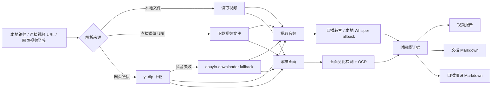

<div align="center">

# 🎬 Video Understanding Skill

让 Codex 看懂、听懂本地视频与视频链接，并整理成可复用的知识 Markdown。

它可以转写口播、识别画面变化、读取屏幕文字，并尽量保留可追溯的时间戳证据。

[English](README.en.md) | [Skill Guide](SKILL.md)


</div>

---

## 为什么需要它

普通视频总结很容易只抽几张图就开始猜：口播和画面不同步，后半段内容被跳过，屏幕里的文档、字幕、课程页也容易漏掉。

`video-understanding` 把视频理解变成一套稳定流程：提取音频、转写口播、按画面变化采样、OCR 识别文字、提取文档正文，并把证据整理成时间线和 Markdown。

适合这些场景：

- 博主视频、课程、播客、访谈、教程
- 屏幕录制、产品演示、软件操作 walkthrough
- 把视频里的文章、文档、笔记、课件提取成 Markdown
- 把视频内容整理进 Obsidian、Notion 或个人知识库

---

## 安全提醒

这个仓库只应该提交源码和说明。

不要提交密钥、本地配置、下载的模型、二进制工具、视频、转写稿、截图或生成报告。仓库的 `.gitignore` 已经排除了 `models/`、`vendor/`、`tools/`、`outputs/`、媒体文件和常见本地缓存。

---

## 新手安装

如果你不熟悉命令行，可以直接把这个仓库链接发给 AI 助手或 Codex，让它帮你安装：

```text
https://github.com/Dublin1231/Video-Understanding-Skill
```

示例提示词：

```text
请帮我安装这个 Codex skill，并检查本机的视频理解依赖是否可用：
https://github.com/Dublin1231/Video-Understanding-Skill
```

助手可以帮你放到正确目录，并检查 Python、FFmpeg、本地转写和 OCR 依赖。

---

## 功能一览

| 功能 | 说明 |
| --- | --- |
| 🔗 视频链接分析 | 支持本地视频、直接视频 URL，以及 `yt-dlp` 可下载的网页视频 |
| 🎙️ 口播转写 | 提取博主、讲师或演示者的音频内容 |
| 🧠 口播转知识 Markdown | 把转写整理成核心观点、流程、案例和时间戳摘录 |
| 🎞️ 变化感知采样 | 根据页面、版式、标题和章节导航变化采样画面 |
| 🔎 中英文 OCR | 识别屏幕录制、课程页、文档视图里的文字 |
| 📄 文档提取 | 把视频里展示的文章、笔记、课件、文档转成 Markdown |
| 🧭 时间线对齐 | 对齐画面、转写、OCR 和时间戳证据 |
| 🛟 本地 fallback | 远程转写不可用时，可用本地 Whisper 继续产出转写 |
| 🗂️ Obsidian 输出 | 可为 Markdown 加 frontmatter，并引用关键截图 |

---

## 工作流程



---

## 安装依赖

| 依赖 | 是否必须 | 用途 |
| --- | --- | --- |
| Python 3.11+ | 必须 | 运行脚本 |
| FFmpeg | 必须 | 提取音频和画面 |
| `openai` | 可选 | 远程转写和多模态总结 |
| `faster-whisper` | 可选 | 本地离线转写 |
| `yt-dlp` | 可选 | 下载网页视频链接 |
| `pillow` | 可选 | 图像处理 |
| `pytesseract` | 可选 | OCR |
| Tesseract 语言包 | 可选 | 提升中英文 OCR 效果 |

安装 Python 包：

```powershell
python -m pip install openai faster-whisper yt-dlp pillow pytesseract
```

第一次本地转写可能会下载模型到 `models/`，这个目录不会提交到 Git。

---

## 模型配置

这个 skill 有两条模型路径：一条用于听音频，一条用于画面/多模态总结。如果只做“口播转知识 Markdown”，可以完全走本地转写路径。

| 用途 | 推荐配置 | 说明 |
| --- | --- | --- |
| 只把口播转成 Markdown | `--speech-only --local-whisper-model small` | 新手最稳路径，本地运行 |
| 完整视频理解报告 | `--model <你的多模态模型>` | 结合画面、OCR、口播和时间线 |
| 远程转写失败 fallback | `--local-whisper-model small` | 远程不可用时自动走本地 |
| 更快本地转写 | `--local-whisper-model base` | 更快但通常没那么准 |
| 更准本地转写 | `--local-whisper-model medium` | 更准但更慢、更占资源 |

常用参数：

```powershell
--model "gpt-5.4"
--transcribe-model "gpt-4o-transcribe-diarize"
--local-whisper-model "small"
```

---

## API Key 和 Base URL

如果只使用 `--speech-only` 加本地 Whisper，不需要远程 API。

如果要完整视频理解报告、远程转写或多模态总结，请在本地环境变量中配置 key 和 base URL。

Windows PowerShell 当前窗口临时配置：

```powershell
$env:OPENAI_API_KEY = "<your_key>"
$env:OPENAI_BASE_URL = "<your_base_url>"
```

Windows 当前用户永久配置：

```powershell
[Environment]::SetEnvironmentVariable("OPENAI_API_KEY", "<your_key>", "User")
[Environment]::SetEnvironmentVariable("OPENAI_BASE_URL", "<your_base_url>", "User")
```

配置后重启终端。

安全建议：

- 不要把真实密钥写进 README、脚本、截图或 Git 提交。
- 如果不确定 base URL，交给 AI 助手帮你根据服务商文档检查。
- 配置后运行 `python scripts/capability_probe.py` 检查环境。

---

## 快速开始

检查本机能力：

```powershell
python scripts/capability_probe.py
```

分析本地视频：

```powershell
python scripts/analyze_video_with_openai.py "C:\path\to\video.mp4" `
  --question "这个视频讲了什么？画面里发生了什么？" `
  --ocr `
  --obsidian-frontmatter `
  --copy-keyframes-dir "outputs\video-report-assets" `
  --markdown-keyframes report `
  --report-md "outputs\video-report.md" `
  --report-json "outputs\video-report.json"
```

分析直接视频 URL：

```powershell
python scripts/analyze_video_with_openai.py "https://example.com/video.mp4" `
  --question "这个视频讲了什么？画面里发生了什么？" `
  --ocr `
  --report-md "outputs\video-report.md"
```

脚本会先尝试直接下载；如果是网页链接，会在安装了 `yt-dlp` 的情况下尝试下载。实际支持范围取决于 `yt-dlp`、网络、登录状态、课程权限和 DRM。

---

## Cookies 和登录态

对于抖音、小红书、课程平台、私有内容等需要登录态的网站，最稳的方式是提供 Netscape 格式的 `cookies.txt`：

```powershell
python scripts/analyze_video_with_openai.py "https://v.douyin.com/xxxx/" `
  --cookies "C:\path\to\cookies.txt" `
  --speech-only `
  --extract-speech-md "outputs\speech-knowledge.md"
```

Chrome/Edge 新版本在 Windows 上可能因为 DPAPI / App-Bound Encryption 导致 `--cookies-from-browser chrome` 失败。出现 `Failed to decrypt with DPAPI` 时，推荐导出 `cookies.txt`。

不要把 `cookies.txt` 上传到 GitHub，也不要发给陌生人；它等同于一段临时登录凭据。

### 用 Get cookies.txt LOCALLY 导出

如果你使用 **Get cookies.txt LOCALLY** 这类浏览器扩展：

1. 先在浏览器里打开目标视频页，并确认能正常播放。
2. 点击浏览器右上角的 **Get cookies.txt LOCALLY** 插件图标。
3. 确认弹窗标题类似 `Get cookies.txt for https://www.douyin.com/...`。
4. `Export Format` 选择 **Netscape**。
5. 点击左上角蓝色 **Export**，只导出当前站点 cookies。
6. 不要点击 **Export All Cookies**，它会导出所有网站 cookies，范围太大。
7. 保存为类似 `C:\Users\你的用户名\Downloads\www.douyin.com_cookies.txt`。

然后这样传给 skill：

```powershell
python scripts/analyze_video_with_openai.py "https://www.douyin.com/video/7623595912924777780" `
  --cookies "C:\Users\你的用户名\Downloads\www.douyin.com_cookies.txt" `
  --ocr `
  --report-md "outputs\web-video-report.md"
```

---

## 抖音专用 fallback

如果 `yt-dlp` 对抖音链接失败，可以接入 [jiji262/douyin-downloader](https://github.com/jiji262/douyin-downloader) 作为专用 fallback。

这个 fallback 已经本地测试过：同一个抖音链接和同一份 cookies，`yt-dlp` 失败，但 `douyin-downloader` 成功下载到完整 mp4。

先准备工具：

```powershell
git clone https://github.com/jiji262/douyin-downloader.git C:\Tools\douyin-downloader
python -m pip install -r C:\Tools\douyin-downloader\requirements.txt
```

然后运行：

```powershell
python scripts/analyze_video_with_openai.py "https://www.douyin.com/video/7623595912924777780" `
  --cookies "C:\Users\你的用户名\Downloads\www.douyin.com_cookies.txt" `
  --douyin-downloader-fallback `
  --douyin-downloader-path "C:\Tools\douyin-downloader" `
  --ocr `
  --report-md "outputs\web-video-report.md"
```

执行顺序是：先直接下载，再 `yt-dlp`，如果仍失败且是抖音链接，再调用 douyin-downloader。最终下载到的 mp4 会进入原本的视频理解流程。

---

## 按需求选择功能

| 你的需求 | 推荐用法 |
| --- | --- |
| 我想知道视频讲了什么、画面发生了什么 | 完整分析，开启 `--ocr`，输出 `--report-md` |
| 我只想把博主口播整理成知识笔记 | `--speech-only --speech-md-mode knowledge` |
| 我想要带时间戳的原始转写稿 | `--speech-only --speech-md-mode literal` |
| 我想提取视频里展示的文档/文章 | `--doc-only --doc-md-mode literal` |
| 我想分析屏幕录制里的每次页面变化 | `--sampling-mode all-changes --scene-detection --screen-layout-filter` |
| 我的视频有底部章节导航或课程目录 | 加 `--title-ocr-filter --chapter-nav-filter --same-chapter-dedupe-filter` |

---

## 口播转知识 Markdown

适合把博主讲解、课程音频、演示口播整理成知识库笔记。

```powershell
python scripts/analyze_video_with_openai.py "C:\path\to\video.mp4" `
  --speech-only `
  --speech-md-mode knowledge `
  --extract-speech-md "outputs\speech-knowledge.md" `
  --report-json "outputs\speech-check.json"
```

| 模式 | 输出 |
| --- | --- |
| `knowledge` | 生成知识结构，并保留带时间戳的原始摘录 |
| `literal` | 只按时间整理原始转写 |

---

## 视频文档提取为 Markdown

适合视频里有人讲解文章、文档、笔记、课程页或幻灯片的场景。

```powershell
python scripts/analyze_video_with_openai.py "C:\path\to\video.mp4" `
  --sampling-mode all-changes `
  --scene-detection `
  --screen-layout-filter `
  --title-ocr-filter `
  --chapter-nav-filter `
  --doc-only `
  --doc-md-mode literal `
  --extract-doc-md "outputs\document.md" `
  --report-json "outputs\document-check.json"
```

| 模式 | 适用场景 |
| --- | --- |
| `literal` | 尽量保留画面中真实出现的文字 |
| `polished` | 将提取内容整理成生成标题和知识段落 |

如果需要“视频中确实出现过的文字”，请使用 `literal`。如果可以接受生成标题和重组结构，再使用 `polished`。

---

## Obsidian 与关键截图

如果要把结果直接放进 Obsidian，可以加：

```powershell
--obsidian-frontmatter `
--copy-keyframes-dir "outputs\video-assets" `
--markdown-keyframes report
```

`--obsidian-frontmatter` 会写入来源、视频路径、时长、转写来源、采样模式和标签。`--markdown-keyframes report` 会在报告里引用抽样关键帧；如果希望口播笔记和文档笔记也引用同一批截图，可以改成 `--markdown-keyframes all`。

---

## 文件结构

```text
video-understanding/
├── README.md
├── README.en.md
├── SKILL.md
├── references/
│   ├── native-openai-path.md
│   ├── openai-hybrid-path.md
│   ├── prompt-templates.md
│   └── timeline-pipeline.md
└── scripts/
    ├── analyze_video_with_openai.py
    ├── build_analysis_brief.py
    └── capability_probe.py
```

---

## 常见问题

| 问题 | 处理方式 |
| --- | --- |
| 缺 FFmpeg | 安装 FFmpeg，并确保命令行能找到 |
| 远程转写不可用 | 使用 `--speech-only` 走本地转写 |
| OCR 效果差 | 安装 Tesseract 中英文语言包 |
| 输出出现生成标题 | 需要忠实原文时使用 `literal` 模式 |
| Git 状态里出现大文件 | 检查 `.gitignore`，不要提交模型、工具、依赖或输出 |

---

## Roadmap

- 更稳定的长视频章节采样
- 更保守的文档提取和 OCR 清洗
- 可选说话人分离摘要
- 更丰富的 Obsidian frontmatter 模板
- 更智能的关键截图筛选

---

## License

MIT License. Free to use, modify, and distribute.
