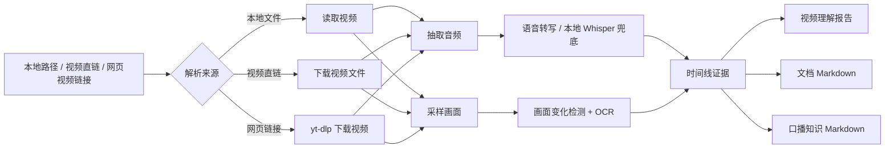

<div align="center">

# 🎬 Video Understanding Skill

把本地视频变成可检索、可复用、可沉淀的知识资产。

它会同时听口播、看画面、读屏幕文字，并把视频内容整理成带时间戳证据的 Markdown。

[English](README.en.md) | [完整 Skill 说明](SKILL.md)


</div>

---

## 为什么需要它

普通的视频总结很容易停留在“抽几帧 + 猜大意”：口播和画面对不上，长视频后半段被忽略，屏幕里的文档和字幕也经常丢失。

`video-understanding` 把视频理解拆成一条更可靠的工作流：先转写音频，再按画面变化采样，结合 OCR、文档抽取和时间线对齐，最后输出可以直接进入知识库的 Markdown。

适合这些场景：

- 课程、播客、访谈、教程的口播整理
- 屏幕录制、产品演示、软件教学的视频理解
- 视频中文档、文章、笔记、课程页的 Markdown 提取
- 将博主内容沉淀为 Obsidian、Notion 或个人知识库素材

---

## ⚠️ 重要说明

这个仓库适合公开发布，但只应该包含源码和文档。

请不要提交本地凭据、私有配置、本地模型、二进制工具、视频素材、转写结果或生成报告。仓库已经配置 `.gitignore`，默认排除 `models/`、`vendor/`、`tools/`、`outputs/`、媒体文件和常见本地缓存。

---

## 🌱 小白安装方式

如果你不熟悉命令行，可以直接把这个仓库链接发给你的 AI 助手或 Codex，让它帮你安装：

```text
https://github.com/Dublin1231/Video-Understanding-Skill
```

你可以这样说：

```text
请帮我安装这个 Codex skill，并检查本地依赖是否可用：
https://github.com/Dublin1231/Video-Understanding-Skill
```

AI 会帮你把 skill 放到正确目录，并根据你的电脑环境检查 Python、FFmpeg、本地转写和 OCR 依赖。

---

## 📸 效果预览

### 🎙️ 口播整理成知识 Markdown

```markdown
# 博主口播整理为知识 Markdown

## 核心观点（生成整理）
- Obsidian 是这套系统的长期记忆，负责沉淀任务、卡片、时间计划和个人经验。
- Claude Code 更适合长上下文深度工作，因为它能调用已有知识库组织内容。
- OpenClaw 更适合轻量、随手、移动端入口，接收想法、链接、日志和任务。

## 原始口播摘录（带时间戳）

### 01:03 - 02:15 知识库作为长期记忆

**整理摘要:** 用 Obsidian 承载任务、卡片和时间三类笔记，让 AI 能读取个人经验、目标和工作规则。

**原文摘录:** ...
```

### 📄 视频中的文档提取成 Markdown

```markdown
# 文档内容

## 画面 @ 62.23s

这里保留视频画面中实际识别到的文档文字。
```

---

## ✨ 核心功能

| 功能 | 说明 |
| --- | --- |
| 🔗 视频链接分析 | 支持本地视频路径、直接视频 URL，以及 `yt-dlp` 可下载的网页视频链接 |
| 🎙️ 口播转写 | 从视频音轨中提取讲解者、博主或课程口播 |
| 🧠 口播知识 Markdown | 将转写内容整理成核心观点、方法流程、案例和原文摘录 |
| 🎞️ 变化即采样 | 根据页面变化、版式变化、标题变化和章节导航选择采样点 |
| 🔎 中英文 OCR | 识别屏幕录制、课程页、文档页中的文字 |
| 📄 文档抽取 | 将视频中展示的文章、笔记、课程页提取为 Markdown |
| 🧭 时间线对齐 | 对齐画面帧、口播片段、OCR 证据和时间戳 |
| 🛟 本地兜底 | 远程转写不可用时，可用本地 Whisper 路径继续生成 transcript |

---

## 🧩 工作流程



---

## 📦 安装与依赖

| 依赖 | 是否必需 | 用途 |
| --- | --- | --- |
| Python 3.11+ | 必需 | 运行脚本 |
| FFmpeg | 必需 | 抽取音频和视频帧 |
| `openai` | 可选 | 远程转写和多模态总结 |
| `faster-whisper` | 可选 | 本地离线转写 |
| `yt-dlp` | 可选 | 下载网页视频链接 |
| `pillow` | 可选 | 图像处理 |
| `pytesseract` | 可选 | OCR |
| Tesseract 语言数据 | 可选 | 改善中英文 OCR |

安装 Python 依赖：

```powershell
python -m pip install openai faster-whisper yt-dlp pillow pytesseract
```

第一次运行本地转写时，模型可能会下载到 `models/`。该目录已被 Git 忽略。

---

## 🧠 模型配置

这个 skill 支持两类模型：一个负责“听音频”，一个负责“看画面并总结”。如果只做口播转知识 Markdown，可以完全走本地模型，不需要远程模型。

| 场景 | 推荐配置 | 说明 |
| --- | --- | --- |
| 只转写口播并整理成 Markdown | `--speech-only` + `--local-whisper-model small` | 最适合新手，稳定、隐私更好、无需上传画面 |
| 视频理解报告 | `--model <你的多模态模型>` | 用于综合分析画面、OCR、口播和时间线 |
| 远程转写失败时兜底 | `--local-whisper-model small` | 远程转写不可用时自动使用本地 Whisper |
| 更快的本地转写 | `--local-whisper-model base` | 速度更快，但准确率通常低一些 |
| 更准的本地转写 | `--local-whisper-model medium` | 准确率更高，但更慢、更吃内存 |

常用参数：

```powershell
--model "gpt-5.4"
--transcribe-model "gpt-4o-transcribe-diarize"
--local-whisper-model "small"
```

新手建议先使用默认配置。如果你不确定自己的模型、网关或本地环境怎么配，可以把仓库链接发给 AI，让它根据你的电脑环境帮你检查并生成命令。

---

## 🔑 密钥与接口地址配置

如果你只使用 `--speech-only` 加本地 Whisper，可以不配置远程接口。  
如果你要生成完整视频理解报告，或者使用远程转写/多模态模型，需要在本机环境变量中配置密钥和接口地址。

### Windows PowerShell

临时配置，只对当前 PowerShell 窗口有效：

```powershell
$env:OPENAI_API_KEY = "<你的密钥>"
$env:OPENAI_BASE_URL = "<你的接口地址>"
```

长期配置，写入当前用户环境变量：

```powershell
[Environment]::SetEnvironmentVariable("OPENAI_API_KEY", "<你的密钥>", "User")
[Environment]::SetEnvironmentVariable("OPENAI_BASE_URL", "<你的接口地址>", "User")
```

设置后重新打开终端，再运行脚本。

### macOS / Linux

临时配置，只对当前终端有效：

```bash
export OPENAI_API_KEY="<你的密钥>"
export OPENAI_BASE_URL="<你的接口地址>"
```

如果使用官方接口，通常只需要配置密钥；如果使用兼容网关或自定义服务，再配置接口地址。

### 配置建议

- 不要把真实密钥写进 README、脚本、聊天记录截图或 Git 提交。
- 不确定接口地址怎么填时，把你的服务商文档发给 AI，让它帮你确认。
- 配置完成后，可以先运行 `python scripts/capability_probe.py` 检查环境是否识别成功。

---

## 🚀 快速开始

检查本地能力：

```powershell
python scripts/capability_probe.py
```

理解一个视频：

```powershell
python scripts/analyze_video_with_openai.py "C:\path\to\video.mp4" `
  --question "这个视频讲了什么？画面里发生了什么？" `
  --ocr `
  --report-md "outputs\video-report.md" `
  --report-json "outputs\video-report.json"
```

也可以直接传入视频链接：

```powershell
python scripts/analyze_video_with_openai.py "https://example.com/video.mp4" `
  --question "这个视频讲了什么？画面里发生了什么？" `
  --ocr `
  --report-md "outputs\video-report.md"
```

脚本会先尝试直链下载；如果链接是网页，会在安装了 `yt-dlp` 的情况下自动尝试下载视频。实际支持范围取决于 `yt-dlp`、网络环境、登录状态、课程权限和视频是否受 DRM 保护。

如果网页链接下载失败，可以把链接发给 AI，让它帮你安装/配置 `yt-dlp`，或让它先把视频下载成本地文件后再分析。

对于抖音、小红书、课程平台、私有内容等需要登录态的网站，最稳的方式是提供 Netscape 格式的 `cookies.txt`：

```powershell
python scripts/analyze_video_with_openai.py "https://v.douyin.com/xxxx/" `
  --cookies "C:\path\to\cookies.txt" `
  --speech-only `
  --extract-speech-md "outputs\speech-knowledge.md"
```

也可以尝试让 `yt-dlp` 从浏览器读取 cookies，但在 Windows 的新版 Chrome/Edge 上，这一步可能会因为 DPAPI / App-Bound Encryption 无法解密而失败：

```powershell
python scripts/analyze_video_with_openai.py "https://v.douyin.com/xxxx/" `
  --cookies-from-browser chrome `
  --speech-only `
  --extract-speech-md "outputs\speech-knowledge.md"
```

如果不确定自己用的是哪个浏览器，可以让脚本自动尝试常见浏览器：

```powershell
python scripts/analyze_video_with_openai.py "https://v.douyin.com/xxxx/" `
  --cookies-from-browser auto `
  --speech-only `
  --extract-speech-md "outputs\speech-knowledge.md"
```

也可以使用 `--auto-cookies`，让普通网页下载失败后自动尝试浏览器 cookies。

如果出现 `Failed to decrypt with DPAPI`，说明不是链接问题，而是 Chrome/Edge 的本机加密阻止了外部程序读取 cookies。推荐改用下面任一方式：

- 用可信浏览器扩展导出当前站点的 Netscape 格式 `cookies.txt`，然后使用 `--cookies "C:\path\to\cookies.txt"`。
- 如果 Firefox 里已经登录该网站，可以尝试 `--cookies-from-browser firefox`。
- 如果仍然失败，先把视频下载成本地 `.mp4`，再交给 skill 分析。

不要把 `cookies.txt` 上传到 GitHub，也不要发给陌生人；它等同于一段临时登录凭据。

如果 `yt-dlp` 和 cookies 都失败，但浏览器里可以正常播放，可以使用“浏览器播放录制 fallback”：先把网页播放画面录成临时 mp4，再交给 skill 分析。

```powershell
python scripts/record_webpage_playback.py "https://www.douyin.com/video/7623595912924777780" `
  --duration 60 `
  --auto-audio `
  --output "outputs\browser-capture.mp4"

python scripts/analyze_video_with_openai.py "outputs\browser-capture.mp4" `
  --ocr `
  --report-md "outputs\browser-capture-report.md"
```

这个模式可以稳定捕获画面；如果电脑没有 Stereo Mix、WASAPI loopback 或虚拟声卡，默认不会录到系统声音。可以先用下面命令查看可用音频设备：

```powershell
python scripts/record_webpage_playback.py --list-devices
```

如果看到可用的系统回放/虚拟音频设备，可以这样录音：

```powershell
python scripts/record_webpage_playback.py "https://www.douyin.com/video/7623595912924777780" `
  --duration 60 `
  --audio-device "你的音频设备名称" `
  --output "outputs\browser-capture.mp4"
```

也可以用 `--auto-audio` 自动尝试选择系统回放/虚拟音频设备。脚本会刻意避开普通麦克风，因为麦克风通常录到的是环境声，不是浏览器声音。如果这次任务必须带声音，可以加 `--audio-required`，找不到可用音频设备时直接失败并提示。

如果没有检测到系统声音设备，可以先看本机引导：

```powershell
python scripts/record_webpage_playback.py --audio-help
```

Windows 常见处理顺序：

- 先尝试开启 Stereo Mix：设置 > 系统 > 声音 > 更多声音设置 > 录制，右键空白处，勾选“显示禁用的设备”，如果看到“立体声混音 / Stereo Mix”就启用它。
- 如果没有 Stereo Mix，可以安装或启用虚拟声卡 / Virtual Audio Cable，然后重新运行 `--list-devices`。
- 看到新设备后，用 `--audio-device "设备名称"` 指定它。
- 不建议用普通麦克风录浏览器视频，因为它会录到环境声、键盘声和回声。

---

## 🧭 按需求选择功能

| 你的需求 | 推荐用法 |
| --- | --- |
| 我想知道视频讲了什么、画面发生了什么 | 使用完整视频分析，开启 `--ocr`，输出 `--report-md` |
| 我只想把博主口播整理成知识笔记 | 使用 `--speech-only --speech-md-mode knowledge` |
| 我想要带时间戳的原始转写稿 | 使用 `--speech-only --speech-md-mode literal` |
| 我想提取视频里展示的文档/文章 | 使用 `--doc-only --doc-md-mode literal` |
| 我想分析屏幕录制里的每次页面变化 | 使用 `--sampling-mode all-changes --scene-detection --screen-layout-filter` |
| 我的视频有底部章节导航或课程目录 | 增加 `--title-ocr-filter --chapter-nav-filter --same-chapter-dedupe-filter` |

---

## 🎙️ 口播转知识 Markdown

适合将博主讲解、课程音频、演示口播整理成知识库笔记。

```powershell
python scripts/analyze_video_with_openai.py "C:\path\to\video.mp4" `
  --speech-only `
  --speech-md-mode knowledge `
  --extract-speech-md "outputs\speech-knowledge.md" `
  --report-json "outputs\speech-check.json"
```

| 模式 | 输出 |
| --- | --- |
| `knowledge` | 生成知识结构，并保留带时间戳的原始摘录 |
| `literal` | 只按时间整理原始转写 |

---

## 📄 视频文档提取为 Markdown

适合视频里有人讲解文章、文档、笔记、课程页或幻灯片的场景。

```powershell
python scripts/analyze_video_with_openai.py "C:\path\to\video.mp4" `
  --sampling-mode all-changes `
  --scene-detection `
  --screen-layout-filter `
  --title-ocr-filter `
  --chapter-nav-filter `
  --doc-only `
  --doc-md-mode literal `
  --extract-doc-md "outputs\document.md" `
  --report-json "outputs\document-check.json"
```

| 模式 | 适用场景 |
| --- | --- |
| `literal` | 尽量保留画面中真实出现的文字 |
| `polished` | 将提取内容整理成生成标题和知识段落 |

如果需要“视频中确实出现过的文字”，请使用 `literal`。如果可以接受生成标题和重组结构，再使用 `polished`。

---

## 🗂️ 文件结构

```text
video-understanding/
├── README.md
├── README.en.md
├── SKILL.md
├── agents/
│   └── openai.yaml
├── references/
│   ├── native-openai-path.md
│   ├── openai-hybrid-path.md
│   ├── prompt-templates.md
│   └── timeline-pipeline.md
└── scripts/
    ├── analyze_video_with_openai.py
    ├── build_analysis_brief.py
    └── capability_probe.py
```

---

## 🛠️ 常见问题

| 问题 | 解决方案 |
| --- | --- |
| 提示缺少 FFmpeg | 安装 FFmpeg，并确保命令行可以直接调用 |
| 远程转写不可用 | 使用 `--speech-only` 走本地转写路径 |
| OCR 效果不好 | 安装 Tesseract 中英文语言数据 |
| 输出里有生成标题 | 需要忠于视频原文时使用 `literal` |
| Git 里出现大文件 | 检查 `.gitignore`，不要提交本地模型、工具、依赖和输出 |

---

## 🗺️ 后续方向

- 更稳定的长视频章节采样
- 更保守的文档抽取与 OCR 清洗
- 可选说话人分离摘要
- Obsidian frontmatter 输出
- Markdown 中附带截图引用

---

## 🤝 贡献

欢迎提交 Issue 和 PR，尤其是：

- 新的视频类型测试样例
- OCR 纠错词表
- 更好的中文知识整理规则
- 跨平台安装说明
- 文档和示例改进

---

## 📜 许可证

MIT License. 可自由使用、修改和分发。
