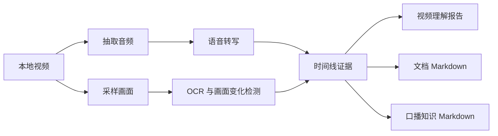

<div align="center">

# 🎬 Video Understanding Skill

把本地视频变成可检索、可复用、可沉淀的知识资产。

它会同时听口播、看画面、读屏幕文字，并把视频内容整理成带时间戳证据的 Markdown。

[English](README.en.md) | [完整 Skill 说明](SKILL.md)


</div>

---

## 为什么需要它

普通的视频总结很容易停留在“抽几帧 + 猜大意”：口播和画面对不上，长视频后半段被忽略，屏幕里的文档和字幕也经常丢失。

`video-understanding` 把视频理解拆成一条更可靠的工作流：先转写音频，再按画面变化采样，结合 OCR、文档抽取和时间线对齐，最后输出可以直接进入知识库的 Markdown。

适合这些场景：

- 课程、播客、访谈、教程的口播整理
- 屏幕录制、产品演示、软件教学的视频理解
- 视频中文档、文章、笔记、课程页的 Markdown 提取
- 将博主内容沉淀为 Obsidian、Notion 或个人知识库素材

---

## ⚠️ 重要说明

这个仓库适合公开发布，但只应该包含源码和文档。

请不要提交本地凭据、私有配置、本地模型、二进制工具、视频素材、转写结果或生成报告。仓库已经配置 `.gitignore`，默认排除 `models/`、`vendor/`、`tools/`、`outputs/`、媒体文件和常见本地缓存。

---

## 🌱 小白安装方式

如果你不熟悉命令行，可以直接把这个仓库链接发给你的 AI 助手或 Codex，让它帮你安装：

```text
https://github.com/Dublin1231/Video-Understanding-Skill
```

你可以这样说：

```text
请帮我安装这个 Codex skill，并检查本地依赖是否可用：
https://github.com/Dublin1231/Video-Understanding-Skill
```

AI 会帮你把 skill 放到正确目录，并根据你的电脑环境检查 Python、FFmpeg、本地转写和 OCR 依赖。

---

## 📸 效果预览

### 🎙️ 口播整理成知识 Markdown

```markdown
# 博主口播整理为知识 Markdown

## 核心观点（生成整理）
- Obsidian 是这套系统的长期记忆，负责沉淀任务、卡片、时间计划和个人经验。
- Claude Code 更适合长上下文深度工作，因为它能调用已有知识库组织内容。
- OpenClaw 更适合轻量、随手、移动端入口，接收想法、链接、日志和任务。

## 原始口播摘录（带时间戳）

### 01:03 - 02:15 知识库作为长期记忆

**整理摘要:** 用 Obsidian 承载任务、卡片和时间三类笔记，让 AI 能读取个人经验、目标和工作规则。

**原文摘录:** ...
```

### 📄 视频中的文档提取成 Markdown

```markdown
# 文档内容

## 画面 @ 62.23s

这里保留视频画面中实际识别到的文档文字。
```

---

## ✨ 核心功能

| 功能 | 说明 |
| --- | --- |
| 🎙️ 口播转写 | 从视频音轨中提取讲解者、博主或课程口播 |
| 🧠 口播知识 Markdown | 将转写内容整理成核心观点、方法流程、案例和原文摘录 |
| 🎞️ 变化即采样 | 根据页面变化、版式变化、标题变化和章节导航选择采样点 |
| 🔎 中英文 OCR | 识别屏幕录制、课程页、文档页中的文字 |
| 📄 文档抽取 | 将视频中展示的文章、笔记、课程页提取为 Markdown |
| 🧭 时间线对齐 | 对齐画面帧、口播片段、OCR 证据和时间戳 |
| 🛟 本地兜底 | 远程转写不可用时，可用本地 Whisper 路径继续生成 transcript |

---

## 🧩 工作流程



---

## 📦 安装与依赖

| 依赖 | 是否必需 | 用途 |
| --- | --- | --- |
| Python 3.11+ | 必需 | 运行脚本 |
| FFmpeg | 必需 | 抽取音频和视频帧 |
| `openai` | 可选 | 远程转写和多模态总结 |
| `faster-whisper` | 可选 | 本地离线转写 |
| `pillow` | 可选 | 图像处理 |
| `pytesseract` | 可选 | OCR |
| Tesseract 语言数据 | 可选 | 改善中英文 OCR |

安装 Python 依赖：

```powershell
python -m pip install openai faster-whisper pillow pytesseract
```

第一次运行本地转写时，模型可能会下载到 `models/`。该目录已被 Git 忽略。

---

## 🚀 快速开始

检查本地能力：

```powershell
python scripts/capability_probe.py
```

理解一个视频：

```powershell
python scripts/analyze_video_with_openai.py "C:\path\to\video.mp4" `
  --question "这个视频讲了什么？画面里发生了什么？" `
  --ocr `
  --report-md "outputs\video-report.md" `
  --report-json "outputs\video-report.json"
```

---

## 🎙️ 口播转知识 Markdown

适合将博主讲解、课程音频、演示口播整理成知识库笔记。

```powershell
python scripts/analyze_video_with_openai.py "C:\path\to\video.mp4" `
  --speech-only `
  --speech-md-mode knowledge `
  --extract-speech-md "outputs\speech-knowledge.md" `
  --report-json "outputs\speech-check.json"
```

| 模式 | 输出 |
| --- | --- |
| `knowledge` | 生成知识结构，并保留带时间戳的原始摘录 |
| `literal` | 只按时间整理原始转写 |

---

## 📄 视频文档提取为 Markdown

适合视频里有人讲解文章、文档、笔记、课程页或幻灯片的场景。

```powershell
python scripts/analyze_video_with_openai.py "C:\path\to\video.mp4" `
  --sampling-mode all-changes `
  --scene-detection `
  --screen-layout-filter `
  --title-ocr-filter `
  --chapter-nav-filter `
  --doc-only `
  --doc-md-mode literal `
  --extract-doc-md "outputs\document.md" `
  --report-json "outputs\document-check.json"
```

| 模式 | 适用场景 |
| --- | --- |
| `literal` | 尽量保留画面中真实出现的文字 |
| `polished` | 将提取内容整理成生成标题和知识段落 |

如果需要“视频中确实出现过的文字”，请使用 `literal`。如果可以接受生成标题和重组结构，再使用 `polished`。

---

## 🗂️ 文件结构

```text
video-understanding/
├── README.md
├── README.en.md
├── SKILL.md
├── agents/
│   └── openai.yaml
├── references/
│   ├── native-openai-path.md
│   ├── openai-hybrid-path.md
│   ├── prompt-templates.md
│   └── timeline-pipeline.md
└── scripts/
    ├── analyze_video_with_openai.py
    ├── build_analysis_brief.py
    └── capability_probe.py
```

---

## 🛠️ 常见问题

| 问题 | 解决方案 |
| --- | --- |
| 提示缺少 FFmpeg | 安装 FFmpeg，并确保命令行可以直接调用 |
| 远程转写不可用 | 使用 `--speech-only` 走本地转写路径 |
| OCR 效果不好 | 安装 Tesseract 中英文语言数据 |
| 输出里有生成标题 | 需要忠于视频原文时使用 `literal` |
| Git 里出现大文件 | 检查 `.gitignore`，不要提交本地模型、工具、依赖和输出 |

---

## 🗺️ 后续方向

- 更稳定的长视频章节采样
- 更保守的文档抽取与 OCR 清洗
- 可选说话人分离摘要
- Obsidian frontmatter 输出
- Markdown 中附带截图引用

---

## 🤝 贡献

欢迎提交 Issue 和 PR，尤其是：

- 新的视频类型测试样例
- OCR 纠错词表
- 更好的中文知识整理规则
- 跨平台安装说明
- 文档和示例改进

---

## 📜 许可证

MIT License. 可自由使用、修改和分发。
