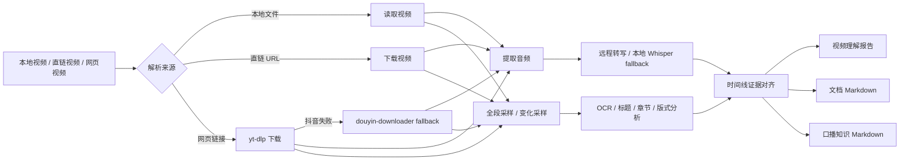

<div align="center">


# Video Understanding Skill

让 Codex 真正“看懂 + 听懂”本地视频、视频链接和网页视频，并整理成可复用的知识 Markdown。  
It understands videos through transcript, OCR, visual-change sampling, document extraction, and knowledge-note output.

[English](README.en.md) | [Skill Guide](SKILL.md)


</div>

---

## 为什么需要它

普通的视频总结很容易停留在“抽几张图猜一下”。这样会漏掉后半段内容、忽略口播与画面的对应关系，也很难把视频里的文档、课程页、屏幕文字真正整理成知识。

`video-understanding` 的目标不是“假装原生视频理解”，而是把视频理解做成一条稳定工作流：

- 提取音频并转写口播
- 按整段视频做画面采样，不只盯前几帧
- 支持“页面变化即采样”的屏幕录制分析
- OCR 读取屏幕文字和文档区域
- 抽取视频里展示的文档正文为 Markdown
- 把证据组织成时间线、知识笔记、Obsidian 笔记

---

## 新手安装

如果你不想自己折腾安装，可以直接把仓库链接发给 AI 助手或 Codex，让它帮你装：

```text
https://github.com/Dublin1231/Video-Understanding-Skill
```

可以直接这样说：

```text
请帮我安装这个 Codex skill，并检查本机 Python、FFmpeg、Whisper、OCR 依赖是否可用：
https://github.com/Dublin1231/Video-Understanding-Skill
```

---

## 功能一览

| 功能 | 说明 |
| --- | --- |
| 🔗 视频链接分析 | 支持本地视频、直链视频、以及 `yt-dlp` 可下载的网页视频 |
| 🎙️ 口播转写 | 提取博主、讲师、演示者的音频内容 |
| 🧠 口播整理为知识 Markdown | 自动整理成核心观点、方法、工具、案例和时间戳摘录 |
| 🖥️ 长视频全段采样 | 不只抽开头，按整段视频覆盖采样 |
| 🔄 页面变化采样 | 针对屏幕录制支持按页面/版式变化采样 |
| 🧭 章节导航理解 | 可利用底部章节导航条辅助判断真正切页 |
| 🔎 中文 + 英文 OCR | 提取屏幕录制、课程页、文档页里的文字 |
| 📄 文档抽取 | 将视频中的文章、笔记、课件、文档转成 Markdown |
| 🪪 Obsidian frontmatter | 输出更丰富的 frontmatter，直接进 Obsidian |
| 🖼️ 智能关键截图 | 不再机械复制全部采样帧，而是优先保留更有信息量的关键截图 |
| 🧑‍🤝‍🧑 说话人摘要 | 当转写结果真的包含 speaker 标签时，输出保守的说话人概览 |
| 🧰 本地 Whisper fallback | 远程转写坏掉时，自动切到本地 faster-whisper |

---

## 工作流



---

## 依赖

| 依赖 | 是否必需 | 用途 |
| --- | --- | --- |
| Python 3.11+ | 必需 | 运行脚本 |
| FFmpeg | 必需 | 提取音频与画面 |
| `openai` | 可选 | 远程转写与多模态总结 |
| `faster-whisper` | 可选 | 本地离线转写 |
| `yt-dlp` | 可选 | 下载网页视频 |
| `pillow` | 可选 | 图像处理 |
| `pytesseract` | 可选 | OCR |
| Tesseract 中文/英文语言包 | 可选 | 提升 OCR 效果 |

安装 Python 包：

```powershell
python -m pip install openai faster-whisper yt-dlp pillow pytesseract
```

---

## 模型与配置

常用配置思路：

| 目标 | 推荐参数 | 说明 |
| --- | --- | --- |
| 只做口播整理 | `--speech-only --local-whisper-model small` | 最稳，几乎不依赖远程网关 |
| 完整视频理解报告 | `--model <你的多模态模型>` | 结合口播、OCR、画面时间线 |
| 远程转写不稳定时兜底 | `--local-whisper-model small` | 自动 fallback 到本地 |
| 更快的本地转写 | `--local-whisper-model base` | 速度快但通常没那么准 |
| 更准的本地转写 | `--local-whisper-model medium` | 更重、更慢 |

常用参数示例：

```powershell
--model "gpt-5.4"
--transcribe-model "gpt-4o-transcribe-diarize"
--local-whisper-model "small"
```

---

## Key 与 Base URL

如果你只用 `--speech-only` 且走本地 Whisper，可以不配置远程 API。  
如果你要完整视频理解、远程转写或多模态总结，请配置本地环境变量：

PowerShell 当前窗口：

```powershell
$env:OPENAI_API_KEY = "<your_key>"
$env:OPENAI_BASE_URL = "<your_base_url>"
```

当前用户持久化：

```powershell
[Environment]::SetEnvironmentVariable("OPENAI_API_KEY", "<your_key>", "User")
[Environment]::SetEnvironmentVariable("OPENAI_BASE_URL", "<your_base_url>", "User")
```

---

## 快速开始

先检查环境：

```powershell
python scripts/capability_probe.py
```

完整分析本地视频：

```powershell
python scripts/analyze_video_with_openai.py "C:\path\to\video.mp4" `
  --question "这个视频讲了什么？画面里发生了什么？" `
  --ocr `
  --obsidian-frontmatter `
  --copy-keyframes-dir "outputs\video-assets" `
  --markdown-keyframes report `
  --report-md "outputs\video-report.md" `
  --report-json "outputs\video-report.json"
```

分析视频链接：

```powershell
python scripts/analyze_video_with_openai.py "https://example.com/video.mp4" `
  --question "这个视频讲了什么？画面里发生了什么？" `
  --ocr `
  --report-md "outputs\video-report.md"
```

---

## 按需求选择

| 你的需求 | 推荐用法 |
| --- | --- |
| 想知道视频都讲了什么、画面发生了什么 | `--ocr --report-md` |
| 只想把博主口播整理成知识笔记 | `--speech-only --speech-md-mode knowledge --extract-speech-md <path>` |
| 想要带时间戳的原始转写 | `--speech-only --speech-md-mode literal --extract-speech-md <path>` |
| 想提取视频里展示的文档/文章 | `--doc-only --doc-md-mode literal --extract-doc-md <path>` |
| 想分析屏幕录制里的每次页面变化 | `--sampling-mode all-changes --scene-detection --screen-layout-filter` |
| 想让章节标题和底部导航条参与切页判断 | `--title-ocr-filter --chapter-nav-filter --same-chapter-dedupe-filter` |

---

## Obsidian 输出

给 Obsidian 用时推荐加上：

```powershell
--obsidian-frontmatter `
--copy-keyframes-dir "outputs\video-assets" `
--markdown-keyframes report
```

现在生成的 frontmatter 会包含：

- `source` / `source_url`
- `video_path`
- `duration_seconds`
- `model`
- `transcript_source`
- `transcript_coverage`
- `speaker_count`
- `sampling_mode`
- `sampling_strategy`
- `aliases`
- `tags`

关键截图也不再是“把所有采样帧都塞进去”，而是优先保留：

- 首帧 / 中段 / 末段锚点
- OCR 文字更丰富的帧
- 更像真正章节切换的帧
- 更靠近转写内容的帧

---

## 口播转知识 Markdown

```powershell
python scripts/analyze_video_with_openai.py "C:\path\to\video.mp4" `
  --speech-only `
  --speech-md-mode knowledge `
  --extract-speech-md "outputs\speech-knowledge.md"
```

说明：

- `knowledge` 会生成知识整理结构
- `literal` 会保留按时间戳排布的原始转写
- 如果远程转写返回了真实 speaker 标签，Markdown 会额外输出保守的“说话人概览”
- 如果是本地 Whisper fallback 且没有 speaker 标签，skill 不会伪造说话人分离

---

## 文档提取到 Markdown

```powershell
python scripts/analyze_video_with_openai.py "C:\path\to\video.mp4" `
  --sampling-mode all-changes `
  --scene-detection `
  --screen-layout-filter `
  --title-ocr-filter `
  --chapter-nav-filter `
  --doc-only `
  --doc-md-mode literal `
  --extract-doc-md "outputs\document.md" `
  --report-json "outputs\document-check.json"
```

说明：

- `literal` 更适合“尽量保留屏幕上真实可见文字”
- `polished` 会把抽取内容整理成更像知识笔记的结构
- 现在文档抽取会更保守地过滤 UI 噪声帧，并对重复页面做去重，减少脏 OCR 混入

---

## Cookies 与网页视频

遇到抖音、课程站、登录态网站时，最稳的方式是提供 Netscape 格式 `cookies.txt`。

如果你使用 **Get cookies.txt LOCALLY**：

1. 打开目标视频页面并确认能正常播放
2. 点击扩展图标
3. 确认当前站点正确
4. `Export Format` 选择 `Netscape`
5. 点击蓝色 `Export`
6. 不要点 `Export All Cookies`
7. 把导出的 `cookies.txt` 路径传给脚本

示例：

```powershell
python scripts/analyze_video_with_openai.py "https://www.douyin.com/video/7623595912924777780" `
  --cookies "C:\Users\YourName\Downloads\www.douyin.com_cookies.txt" `
  --douyin-downloader-fallback `
  --ocr `
  --report-md "outputs\web-video-report.md"
```

---

## 当前状态

已经完成：

- 更丰富的 Obsidian frontmatter 模板
- 更智能的关键截图筛选
- 更保守的文档提取和 OCR 清洗
- 在有真实 speaker 标签时输出可选说话人摘要

还可以继续增强：

- 更稳定的长视频章节采样
- 更强的低清视频 OCR 清洗
- 更高级的多说话人角色摘要

---

## License

MIT License.
